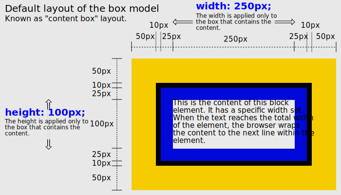
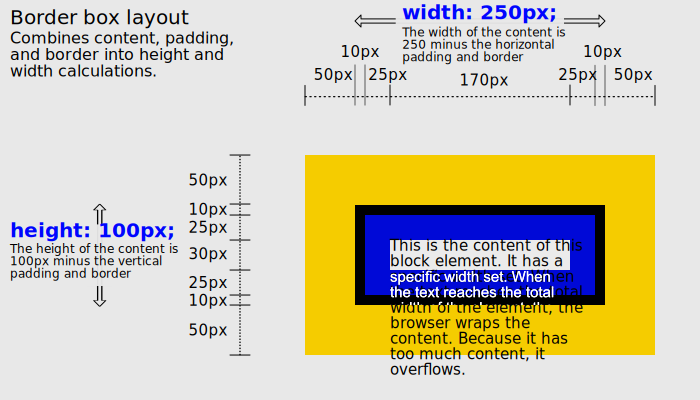
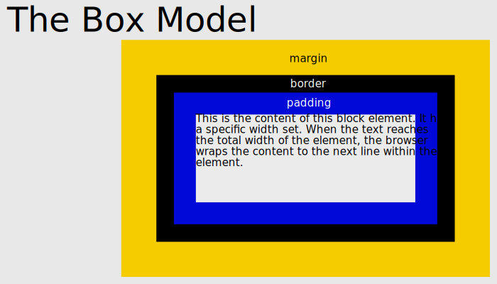

# The Box Model

## Block vs Inline Boxes

### Block Boxes

Declared with `display: block`

> Default for `div`, `h1-6`, `p` [list of additional block elements](https://developer.mozilla.org/en-US/docs/Web/HTML/Block-level_elements#elements)

- The box fills available container space, and in most cases it fills up 100% of the available space, becoming as wide as its container.
- Each new box appears on a new line/row.
- The CSS properties width and height are respected.
- The padding, margin and border of the box will push other elements farther away from the box.

### Inline Boxes

Declared with `display: inline`

> Default for `span`, `a`, `img` [list of additional inline elements](https://developer.mozilla.org/en-US/docs/Web/HTML/Inline_elements#list_of_inline_elements)

- Each box appears next to each other in a single line until it fills up the available space.
- The CSS properties width and height don't apply.
- The padding, margin and border of a box are applied, but they don't push other inline boxes away from the box.

### Inline-block Boxes

`inline-block` allows you to have elements laid out left to right, and also take in to account the specified height/width properties. It allows columns without needing the `float` hack.

---

## Content Box vs Border Box Model

### Content (ie standard) Box Model

In content box, `width` and `height` of element in CSS refers to the width and height of the box's content. Additional `padding`, `border`, or `margin` is added to the total size of the box.

### Content Box Example

```css
.box {
  border: 10px solid black; /* Applies to all four sides. */
  height: 100px; /* Content's height */
  margin: 50px; /* Applies to all four sides. */
  padding: 25px; /* Applies to all four sides. */
  width: 250px; /* Content's width */
}
```



### Border Box Model

To make the `width` and `height` include the padding, (not margin), border-box is used.

```css
.box {
  border: 10px solid black; /* Applies to all four sides. */
  box-sizing: border-box;
  height: 100px; /* Sum of content + top/bottom padding + top/bottom border */
  margin: 50px; /* Applies to all four sides. */
  padding: 25px; /* Applies to all four sides. */
  width: 250px; /* Sum of content + left/right padding + left/right border */
}
```



## Margin, Border, and Padding



### Padding

```css
.box-1 {
  /* One value applies to all four sides. */
  padding: 3em;
}

.box-2 {
  /* Two values: top & bottom | left & right */
  padding: 20% 5%;
}

.box-3 {
  /* Three values: top | left & right | bottom. */
  padding: 15px 10px 20px;
}

.box-4 {
  /* Four values:  top | right | bottom | left*/
  padding: 0 10px 2em 1em;
}

.box-5 {
  /* Global values */
  padding: inherit; /* OR initial OR unset */
}
```

In CSS, `background-color` and `background-image` are applied to the area covered by both the content plus padding.

### Border

Border is factored in to the total box size in the box model.

```css
.box {
  border: 3px solid #000000;
  /* border-width | border-style | border-color */
}
```

### Margin

```css
.box-1 {
  /* One value applies to all four sides. */
  margin: 10%;
}

.box-2 {
  /* Two values: top & bottom | left & right */
  margin: 0 2em;
}

.box-3 {
  /* Three values: top | left & right | bottom. */
  margin: 30px 0 15px;
}

.box-4 {
  /* Four values:  top | right | bottom | left*/
  margin: 10% 20px 10px 5%;
}

.box-5 {
  /* Global values */
  margin: inherit;  /* OR initial OR unset */
```

Center a margin with `auto`

```css
.box-parent {
  background-color: #000000; /* Black */
  width: 300px;
  height: 300px;
}

.box-child {
  background-color: #ffff00; /* Yellow */
  width: 100px;
  height: 280px;
  padding: 10px;
  margin: 0 auto; /* Centers element horizontally. */
}
```

### Old School Centering

Prior to flexbox and its container property `justify-content`, using `margin: 0 auto` to center elements inside a container was standard practice, and it's still used for centering elements on browsers that do not support flexbox (like older versions of IE).
