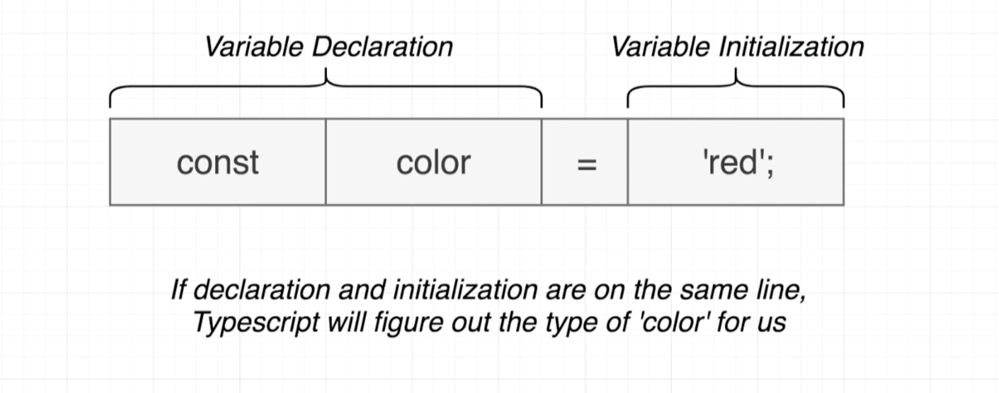

# Typescript Basics

## Type annotations

```ts
let apples: number = 5;
let speed: string = "fast";
let hasName: boolean = true;

let nothingMuch: null = null;

// built in objects
let now: Date = new Date(); //now can only assign now a type of Date
```

### Arrays

```ts
let colors: string[] = ["red", "green", "blue"];
```

`string[]` doesn't create an array, just declares the type of `colors`

### Classes

```ts
class Car {}
let car: Car = new Car();
```

### Object literal

```ts
let point: { x: number; y: number } = {
  x: 10,
  y: 20,
};
```

### Function

```ts
const logNumber: (i: number) => void = (i: number) => {
  console.log(i);
};
```

- Annotation `: (i: number) => void`
- Function `(i: number) => {`

## Type Inference



Avoid variables with 'any' at all costs
